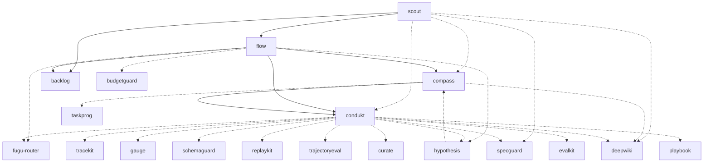

# Plugin dependency graph + per-plugin reachability

This monorepo ships ~35 plugins. A few of them (`flow`, `condukt`, `scout`,
`compass`) orchestrate the others, invoking sibling plugins across their skill
phases. There was no single view of **who calls whom** or **how each plugin is
reached**. This doc is that view.

It **complements** [`docs/plugin-activation-scopes.md`](./plugin-activation-scopes.md):

- **`plugin-activation-scopes.md`** answers *HOW is a plugin triggered?*
  (always-on hook / event-scoped hook / manual skill / manual CLI). It is the
  authoritative source for the **activation scope** column below and is
  regenerated by `cargo run -q -p harness-status -- plugins`.
- **This doc** answers *WHICH plugins call which?* (the cross-plugin dependency
  DAG) and combines it with the activation scope into a single **reachability**
  answer per plugin ("how is this plugin reached?" = its own trigger **plus** any
  sibling plugin that invokes it).

All edges below are evidence-based: each caller→callee edge comes from a slash
command, a bash invocation, or an artifact read found in the caller's
`SKILL.md` / agent file. `file:line` citations are given throughout.

Scope note: the two plain library crates `harness-core` and `mutategate` present
no plugin surface (no hooks/skills/agents) and are **excluded** from the 35, exactly
as in `plugin-activation-scopes.md`.

---

## 1. Dependency DAG

Solid arrows (`-->`) = **hard / primary-path** dependency: the caller's main
documented flow invokes the callee unconditionally (no `if present` guard).
Dotted arrows (`-.->`) = **soft / optional** dependency: the call is guarded
(`if command -v X` / "X があれば" / `2>/dev/null || true`) and the caller
degrades gracefully when the callee is absent.

The graph below is drawn as a **DAG** (forward edges only, sources → driver →
executor → telemetry/eval sinks). Three cycle-inducing back-edges are *omitted
from the picture and listed separately* under "Cycles / back-edges" so the
rendered graph stays acyclic. The adjacency list further down includes **every**
edge (forward + back) so no information is lost.



### Adjacency list (survives where mermaid does not render)

Every directed caller → callee edge (**30 total**). `[H]` = hard/primary,
`[S]` = soft/optional, `[B]` = back-edge (creates a cycle; see next section).

```
scout      → backlog[H], flow[H], condukt[S], compass[S], specguard[S], deepwiki[S]
flow       → condukt[H], backlog[H], compass[H], fugu-router[S], hypothesis[S], budgetguard[S]
compass    → condukt[H], deepwiki[S], taskprog[S]
hypothesis → compass[S]
condukt    → fugu-router[S], hypothesis[S][B], tracekit[S], gauge[S], deepwiki[S],
             specguard[S], schemaguard[S], replaykit[S], trajectoryeval[S],
             curate[S], evalkit[S], playbook[S], compass[S][B], backlog[S][B]
```

Out-degree: condukt 14 · flow 6 · scout 6 · compass 3 · hypothesis 1. Every
other plugin has out-degree 0 (they never invoke a sibling plugin).

### Cycles / back-edges

The system is *designed* as a forward pipeline (sources → `flow` → `condukt` →
telemetry/eval sinks), but `condukt`'s **Phase 0-next** ("what's next?"
discovery) and the **PDO measurement loop** add three back-edges that turn the
strict DAG into a cyclic graph. They are guarded reads/writes, not part of the
main execution path, so they are excluded from the mermaid picture above:

- **`condukt -.-> compass`** — Phase 0-next reads `compass gap` to pick the next
  move (`crates/condukt/skills/condukt/SKILL.md:96`). Combined with the forward
  `compass --> condukt` handoff, this forms a **2-cycle `condukt ↔ compass`**.
- **`condukt -.-> backlog`** — Phase 0-next reads `backlog list --status pending`
  (`SKILL.md:93`). `backlog` calls no one, so this adds **no** cycle on its own,
  but it is a back-edge against the source→executor layering.
- **`condukt -.-> hypothesis`** — Phase 1 injects open hypotheses and Phase 8
  transitions `linked_hypotheses` to `awaiting-measurement`
  (`SKILL.md:155-162`, `SKILL.md:603-620`). Combined with `hypothesis -.-> compass`
  and `compass --> condukt`, this forms a **3-cycle
  `condukt → hypothesis → compass → condukt`** (the build ≠ validate PDO loop).

All three are the intended feedback loops of the autonomy design (condukt
self-primes its next task from the sources; the PDO loop closes measurement back
onto the goal). They are called out here rather than hidden.

---

## 2. condukt's soft-dependency table (the ~10 seed deps)

condukt's SKILL invokes ~10 optional plugins scattered across its phases. **All
are soft**: each is guarded and condukt completes normally when the dep is
absent. Evidence cites `crates/condukt/skills/condukt/SKILL.md`.

| Dependency | condukt phase | Invocation | Hard/soft | Graceful degradation when absent (evidence) |
|---|---|---|---|---|
| **schemaguard** | Phase 2 (pre-validate) | `schemaguard check --schema decomposition --file <json>` | soft | `if command -v schemaguard` guard (`:196,:200`); if absent, skip the re-ask and go straight to `condukt validate`. |
| **tracekit** | Phase 4 (interpreter root span) + Phase 6 (worker/verifier spans) | `tracekit record --run "$RID" --span … --phase …` | soft | "tracekit バイナリが PATH 上にあれば … 未導入なら no-op" (`:294-302`); Phase 6: "tracekit が無ければ丸ごと skip (soft・Phase 6 を壊さない)" (`:544-547`). No spans recorded; replaykit later finds none. |
| **gauge** | Phase 6 (per-task cost) | `gauge subagents --json` → fallback `gauge session --json` | soft | Piped `2>/dev/null`; "subagents が取れない場合 … フォールバック" (`:511-516`); "それ未満は `--json` を知らずエラー→0" (`:524`). Cost degrades subagent→session→`0.0`; routing still proceeds. |
| **trajectoryeval** | Phase 6 (trajectory verify) | `trajectoryeval extract … ` / `trajectoryeval check --expected … --actual …` | soft | `if command -v trajectoryeval && [ -n "$EXPECTED_TRAJ" ]` (`:467`); "trajectoryeval バイナリが無ければ丸ごと skip (soft・Phase 6 を壊さない)" (`:464`). Also only runs when the task carries `expected_trajectory`. |
| **curate** | Phase 6 (golden promotion **proposal**) | echoes `curate promote "<title>" --dataset <name>` (HOTL, never auto-runs) | soft | `if command -v curate` (`:565`); "自動実行はしない＝HOTL" (`:563`). If absent, no suggestion is printed. |
| **evalkit** | Phase 6/8 (CI consumer of goldens) | `evalkit canary --baseline <old> --current <new>` (`:538`); `evalkit run` / `eval.yml` consume curate + replaykit goldens (`:571,:673-675`) | soft (indirect) | Not invoked inside the condukt turn — it is the terminal CI consumer of the curate/replaykit goldens. If absent, goldens simply accumulate unread until CI runs evalkit. |
| **deepwiki** | Phase 1 (inject wiki pages) + Phase 8 (`deepwiki refresh`) | `ls .deepwiki/*.md`; `deepwiki refresh` | soft | ".deepwiki/ があれば" (`:165`); "deepwiki バイナリが PATH 上にある場合のみ" (`:653`); "wiki 更新の失敗は condukt 完了を阻害しない" (`:659`). |
| **specguard** | Phase 8 (spec-drift audit) | `specguard prompt --json` → auditor subagents → `specguard ingest` | soft | "specguard バイナリが PATH 上にあり、かつ … `specguard.toml` が存在する場合のみ" (`:628`); "spec-drift findings は condukt 完了を阻害しない" (`:649`). |
| **replaykit** | Phase 8 (promote trace → golden) | `replaykit promote --run "$RID" --root . --evals-dir evals --dataset replayed` | soft | "replaykit バイナリが PATH 上にあり、かつ … `spans.jsonl` が存在する場合のみ … トレースが無ければ silent no-op" (`:668,:664-665`); "promote の失敗は condukt 完了を阻害しない" (`:676`). |
| **playbook** | Phase 1 (playbook search) | realized via `fugu-router procedures search --query …`; stored in `~/.fugu-router/playbooks.jsonl` | soft | `if command -v fugu-router` (`:149-151`); "次回 Phase 1 の playbook 検索に現れる" (`:533-534`). **Nuance:** condukt's playbook capability is entirely **fugu-router-mediated** — the standalone `playbook` plugin (its own `UserPromptSubmit` hook) is **not** invoked directly. See §4. |

> `fugu-router` and `hypothesis` are *also* condukt soft-deps (model routing and
> PDO linkage respectively) but are not part of the "~10 telemetry/eval seed"
> above; they appear in the DAG and the reachability table.
> `condukt` also **mentions** `tdd` once ("tdd/specguard を経路面から補強",
> `:463`) but does **not** invoke it — that is a conceptual reference, not an edge.

---

## 3. Per-plugin reachability table (all 35)

"How is this plugin reached?" = its own **activation scope / entry point** (from
`harness-status plugins`, authoritative — must match `plugin-activation-scopes.md`)
**plus** the **Called-by** column (which sibling plugins invoke it, derived from
the DAG edges above). Sorted alphabetically.

| Plugin | Activation scope | Entry point (trigger) | Called-by (sibling plugins) |
|---|---|---|---|
| autoflow | always-on | `SessionStart`, `Stop` hooks | — |
| backlog | manual | `/backlog` skill; `backlog` CLI | flow, scout, condukt |
| beacon | event-scoped | `Notification`, `SessionEnd` hooks | — |
| blastguard | always-on | `PreToolUse` hook | — |
| budgetguard | always-on | `Stop` hook | flow |
| compass | always-on | `SessionEnd`, `SessionStart` hooks; `/compass` skill | flow, scout, hypothesis, condukt (Phase 0-next, back-edge) |
| condukt | always-on | `SessionStart`, `Stop` hooks; `/condukt` skill; `condukt` CLI | flow, compass, scout |
| context-governor | always-on | `PostToolUse`, `PreCompact`, `SessionStart`, `Stop`, `SubagentStop`, `UserPromptSubmit` hooks | — |
| ctxrot | always-on | `PostToolUse`, `PreCompact`, `PreToolUse`, `SessionStart`, `Stop`, `UserPromptSubmit` hooks; `/ctx`, `/distill` skills | — |
| curate | manual | CLI only | condukt |
| daily | always-on | `SessionStart` hook | — |
| deepwiki | manual | `deepwiki-writer` agent; `deepwiki` CLI | condukt, scout, compass |
| difflog | always-on | `SessionEnd`, `SessionStart` hooks; `/difflog` skill | — |
| donegate | always-on | `Stop` hook | — |
| evalkit | manual | CLI only | condukt (indirect / CI consumer) |
| flow | always-on | `SessionStart` hook; `/flow` skill | scout |
| fugu-router | always-on | `UserPromptSubmit` hook; `/fugu-router` skill; `fugu-router` CLI | condukt, flow |
| gauge | event-scoped | `SessionEnd` hook; `gauge` CLI | condukt |
| harness-status | manual | CLI only; `/status` skill | — (library / inspection dashboard) |
| hypothesis | always-on | `SessionStart` hook; `/hypothesis`, `/hypothesis:add` skills; `hypothesis` CLI | flow, condukt |
| playbook | always-on | `UserPromptSubmit` hook | — (condukt's "playbook" search is fugu-router-mediated, **not** this plugin — see §4) |
| precommit-audit | always-on | `Stop` hook | — |
| propguard | always-on | `Stop` hook | — |
| replaykit | manual | CLI only | condukt |
| reviewgate | always-on | `Stop` hook | — |
| runbook | always-on | `UserPromptSubmit` hook | — |
| schemaguard | manual | CLI only | condukt |
| scout | manual | `/scout` skill | — (user-only entry point) |
| session-insights | always-on | `PostToolUse`, `SessionEnd` hooks | — |
| specguard | always-on | `SessionStart` hook; `/specguard` skill; `specguard-auditor` agent; `specguard` CLI | condukt, scout |
| stuckguard | always-on | `PostToolUse` hook | — |
| taskprog | always-on | `SessionEnd`, `SessionStart` hooks; `/taskprog` skill | compass |
| tdd | always-on | `Stop` hook; `/tdd` skill | — (condukt mentions but does not invoke it) |
| tracekit | manual | CLI only | condukt |
| trajectoryeval | manual | CLI only | condukt |

Counts reconcile with `plugin-activation-scopes.md`: **always-on 23 ·
event-scoped 2 · manual 10 · total 35** (library crates `harness-core`,
`mutategate` excluded). The activation-scope / entry-point columns are taken
verbatim from `harness-status plugins`; the "+ skill / + CLI / + agent" suffixes
only add the secondary surfaces that make the "Called-by" invocations possible
(e.g. `flow` invokes `condukt` via its `/condukt` skill) and do not change the
scope classification.

---

## 4. Isolated / leaf plugins

These plugins neither invoke another plugin nor are invoked by one — they are
reached **only** via their own hook/skill/CLI trigger (user or lifecycle event).
They are the standalone guardrail / telemetry / hook plugins that operate purely
on their own activation surface:

`autoflow`, `beacon`, `blastguard`, `context-governor`, `ctxrot`, `daily`,
`difflog`, `donegate`, `harness-status`, `playbook`, `precommit-audit`,
`propguard`, `reviewgate`, `runbook`, `session-insights`, `stuckguard`, `tdd`
(**17 plugins**).

Two nuances worth flagging:

- **`playbook`** appears in condukt's soft-dep table (§2) yet is listed here as
  isolated. That is deliberate and evidence-based: condukt's "playbook 検索"
  reads/writes `~/.fugu-router/playbooks.jsonl` **through `fugu-router`**, so the
  actual call edge is `condukt -.-> fugu-router`, and the standalone `playbook`
  plugin (an `UserPromptSubmit` hook that surfaces playbooks to the user) is
  never called by another plugin. If you are auditing "is the `playbook` plugin
  wired into condukt?", the answer is **no — the name collides with a
  fugu-router-backed capability**.
- **`tdd`** is referenced conceptually by condukt (`SKILL.md:463`) but is never
  invoked, so it is a leaf.

The remaining non-leaf plugins form the orchestration core: `scout` and
`compass` (sources) feed `flow` (driver) and `condukt` (executor); `backlog`
queues; `fugu-router` routes; and the `condukt` telemetry/eval sinks
(`tracekit`, `gauge`, `deepwiki`, `specguard`, `schemaguard`, `replaykit`,
`trajectoryeval`, `curate`, `evalkit`) close the record → replay → eval loop.
